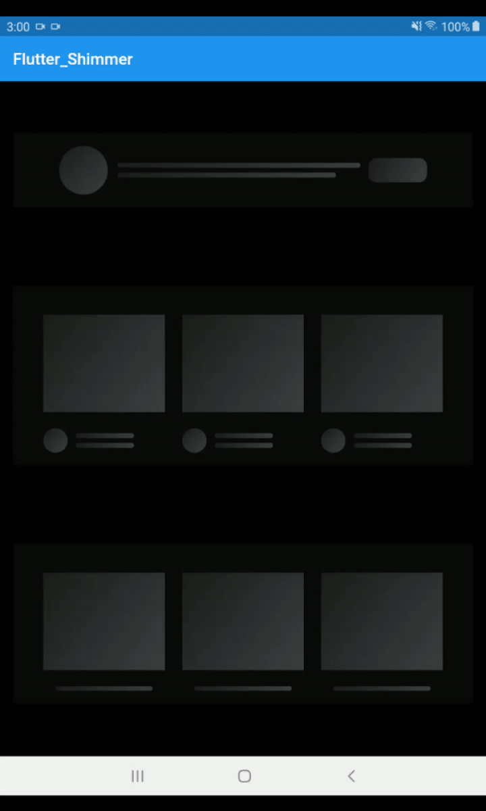
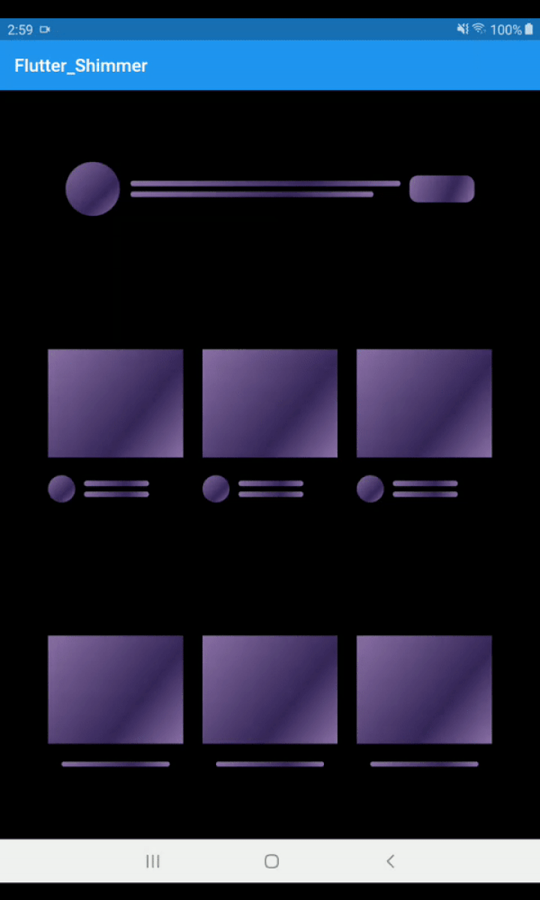
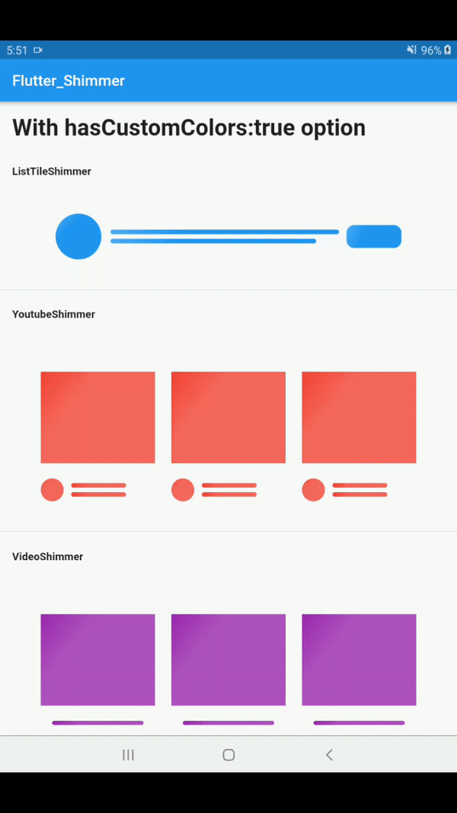

# flutter_shimmer

flutter_shimmer package for creating Shimmer effect that indicate a loading status, so instead of using ProgressBar or usual loader use Shimmer for a better design and user interface.

### Show some :heart: and star the repo to support the project

| # Shimmer Mode                | # Screenshot             | # Code Example                                         |
| ----------------------------- | ------------------------ | ------------------------------------------------------ |
| # Play Store Shimmer          |  | PlayStoreShimmer()                                     |
| # Light Mode Shimmer          |  | ListTileShimmer()                                      |
| # Dark Mode Shimmer           |  | ListTileShimmer(isDarkMode: true)                      |
| # Purplish Mode Shimmer       |  | ListTileShimmer(isPurplishMode: true)                  |
| # Purplish(Dark) Mode Shimmer |  | ListTileShimmer(isPurplishMode: true,isDarkMode: true) |
| # CustomColor Mode            |  | ProfileShimmer(hasCustomColors: true,                  |

          colors: [Color(0xFF651fff), Color(0xFF834bff), Color(0xFF4615b2)],
        ),                                      |

          // Step 1: set hasCustomColors property to true
          hasCustomColors: true,
          // Step 2: give 3 colors to colors property
          colors: [
            // Dark color
            Color(0xFF618833),
            // light color
            Color(0xFFa2cf6e),
            // Medium color
            Color(0xFF8bc34a)
          ],
          hasBottomLines: true,
          // isDarkMode: true,
        ),|

# Get Started

```
 #Color Mode
     There are three color mode in the flutter_shimmer package
      1. Light Mode
      2. Dark Mode
      3. Purplish Mode
      4. Custom Color Mode (New)
```

```
# Optional Options:
    [isRectBox]: when it is true then it will show Rectancle shape else(false) show circle shape by defult its value false
    [isDarkMode]: when it is true then it will use black bg color otherwise it use transparent color by defult its value false
    [isPurplishMode]: when it is true then it will use little bit purplish bg color otherwise it use transparent color by defult its value false
    [isDisabledAvatar]: when it is true then it will hide circle avatar by default it's false
    [isDisabledButton]: Note:- this property only used in ListTileShimmer. when it's true then it will hide right side button shape shimmer from ListTileShimmer by default it's contain false value.
    [beginAlign]: it will set the begin value for gradientColor by defult its value Alignment.topLeft
    [endAlign]: it will set the end value for gradientColor by defult its value Alignment.bottomRight
    [hasBottomBox]: when it is true then it will show bottom Rect style Boxes otherwise its hide the Boxes by defult its value false
    [padding]: it wiil set the padding of parent container by default its value 16.0 from all side(left,right,top,bottom)
    [margin]: it wiil set the margin of parent container by default its value 16.0 from all side(left,right,top,bottom)
    [hasCustomColors]: it will allow you to use custom colors by default its value is false. set true if you want to use your own custom colors
    [colors]: it will contains 3 colors list if you set "hasCustomColors" Property to true the your next step is give the list of colors to this colors property
    Note: make sure the colors property contains only 3 colors not more or lesser than 3 othewise it will use its default colors

```

```
# For Custom Colors:
      for custom colors you need to take two steps

         Step 1: set 'hasCustomColors' property to true
         Step 2: give 3 colors to 'colors' property

     # Example:
         ListTileShimmer(
          // Step 1: set hasCustomColors property to try
          hasCustomColors: true,
          // Step 2: give 3 colors to colors property
          colors: [
            // Dark color
            Color(0xFF1769aa),
            // light color
            Color(0xFF4dabf5),
            // Medium color
            Color(0xFF2196f3)
          ],
        ),


```

# 1. ProfileShimmer

```
  1. Light Mode
    ProfileShimmer(),

  2. Dark Mode
    ProfileShimmer( isDarkMode: true,),

  3. PurplishMode with light Background

     ProfileShimmer(
      isPurplishMode: true,
   ),

  5. PurplishMode with dark Background

     ProfileShimmer(
      isPurplishMode: true,
      isDarkMode:true
   ),

 6. With Bottom Lines:

    ProfileShimmer(
      hasBottomLines: true,
   ),

 7. Combination of all options

    ProfileShimmer(
      isPurplishMode: true,
      hasBottomLines: true,
      isDarkMode: true,
   ),
```

# 2. ProfilePageShimmer

```
  1. Light Mode
    ProfilePageShimmer(),

  2. Dark Mode
    ProfilePageShimmer( isDarkMode: true,),

  3. PurplishMode with light Background

     ProfilePageShimmer(
      isPurplishMode: true,
   ),

  5. PurplishMode with dark Background

     ProfilePageShimmer(
      isPurplishMode: true,
      isDarkMode:true
   ),

 6. With Bottom Boxes:

    ProfilePageShimmer(
      hasBottomBox: true,
   ),

 7. Combination of all options

    ProfilePageShimmer(
      isPurplishMode: true,
      hasBottomLines: true,
      isDarkMode: true,
   ),
```

# 3. VideoShimmer

```
  1. Light Mode
    VideoShimmer(),

  2. Dark Mode
    VideoShimmer( isDarkMode: true,),

  3. PurplishMode with light Background

     VideoShimmer(
      isPurplishMode: true,
   ),

  5. PurplishMode with dark Background

     VideoShimmer(
      isPurplishMode: true,
      isDarkMode:true
   ),

 6. With Bottom Lines:

    VideoShimmer(
      hasBottomLines: true,
   ),

 7. Combination of all options

    VideoShimmer(
      isPurplishMode: true,
      hasBottomLines: true,
      isDarkMode: true,
   ),
```

# 4. ListTileShimmer

```
  1. Light Mode
    ListTileShimmer(),

  2. Dark Mode
    ListTileShimmer( isDarkMode: true,),

  3. PurplishMode with light Background

     ListTileShimmer(
      isPurplishMode: true,
   ),

  5. PurplishMode with dark Background

     ListTileShimmer(
      isPurplishMode: true,
      isDarkMode:true
   ),

 6. With Bottom Lines:

    ListTileShimmer(
      hasBottomLines: true,
   ),

 7. Combination of all options

    ListTileShimmer(
      isPurplishMode: true,
      hasBottomLines: true,
      isDarkMode: true,
   ),
```

# 5. PlayStoreShimmer

```
  1. Light Mode
    PlayStoreShimmer(),

  2. Dark Mode
    PlayStoreShimmer( isDarkMode: true,),

  3. PurplishMode with light Background

     PlayStoreShimmer(
      isPurplishMode: true,
   ),

  5. PurplishMode with dark Background

     PlayStoreShimmer(
      isPurplishMode: true,
      isDarkMode:true
   ),

 6. With Bottom Lines:
         note:   By deafult both lines are true

   a) it will remove only first bottom line
    ListTileShimmer(
      hasBottomFirstLine:false
     ),

  b) it will remove only second bottom line
     ListTileShimmer(
      hasBottomSecondLine:false
     ),

  c) it will remove both bottom line
     ListTileShimmer(
      hasBottomFirstLine:false,
      hasBottomSecondLine:false
     ),

 7. With Multiple options

    PlayStoreShimmer(
      isPurplishMode: true,
      hasBottomLines: true,
      isDarkMode: true,
   ),
```

```
   Thank for your love and support
   if you have any suggestions let me know
```
